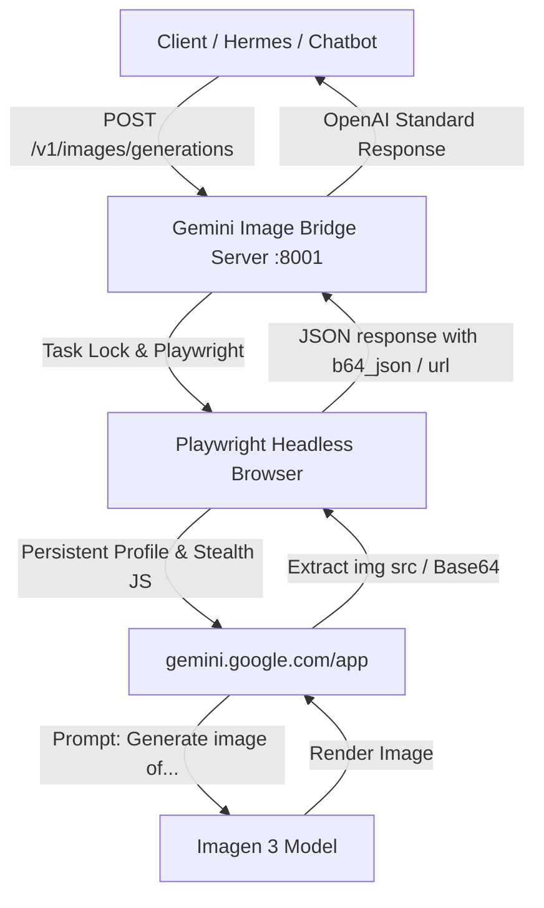

# Gemini Headless Image Generation Bridge

ระบบสร้างภาพผ่าน Headless Browser ไปยัง `gemini.google.com` (Imagen / Gemini Web UI) และเปิดให้บริการเป็น REST API มาตรฐาน OpenAI (`/v1/images/generations`)

---

## สถาปัตยกรรมการทำงาน



---

## ขั้นตอนการเริ่มใช้งาน (Quick Start)

### 1. ล็อกอินบัญชี Google ครั้งแรก (One-time Setup)
เนื่องจาก Google ป้องกันการล็อกอินผ่าน Headless Browser อัตโนมัติ ให้รันคำสั่งนี้เพื่อเปิดหน้าต่าง Browser ขึ้นมาล็อกอิน 1 ครั้ง:

```bash
python3 gemini_image_bridge.py --setup-login
```
- ล็อกอินบัญชี Google Account ให้เรียบร้อย
- รอจนเข้าสู่หน้าหลักของ Gemini (`https://gemini.google.com/app`)
- ข้อมูลการล็อกอินจะถูกบันทึกไว้ใน `~/.config/gemini-image-bridge/browser_profile/`

---

### 2. ตรวจสอบสถานะการเชื่อมต่อ (Check Auth)
```bash
python3 gemini_image_bridge.py --check-auth
```

---

### 3. การนำ Auth ไปใช้บน Linux Server (Headless / Text Mode)
สำหรับ Linux Server ที่ไม่มีหน้าจอ GUI (Text mode / VPS) คุณสามารถ Export Auth จากเครื่อง Mac/PC แล้วนำไป Import บน Linux ได้ 2 วิธี:

#### วิธีที่ A: Export / Import Auth State (JSON) - แนะนำ
1. **บนเครื่อง Mac (ที่ Login สำเร็จแล้ว)**:
   ```bash
   python3 gemini_image_bridge.py --export-auth gemini_auth.json
   ```
2. **ส่งไฟล์ไปยัง Linux Server**:
   ```bash
   scp gemini_auth.json user@linux-server:~/antigravity-bridge/
   ```
3. **บน Linux Server (Text Mode)**:
   ```bash
   python3 gemini_image_bridge.py --import-auth gemini_auth.json
   ```

#### วิธีที่ B: คัดลอกโฟลเดอร์ Profile ทั้งก้อน
```bash
# บน Mac
tar -czvf gemini_profile.tar.gz -C ~/.config/gemini-image-bridge browser_profile
scp gemini_profile.tar.gz user@linux-server:~/.config/gemini-image-bridge/

# บน Linux Server
mkdir -p ~/.config/gemini-image-bridge
tar -xzvf gemini_profile.tar.gz -C ~/.config/gemini-image-bridge/
```

#### วิธีที่ C: Inject ด้วย Raw Cookie Header
```bash
python3 gemini_image_bridge.py --import-cookies "__Secure-1PSID=...; __Secure-1PSIDTS=...; SID=..."
```

---

### 4. ทดสอบสร้างรูปผ่าน Terminal โดยตรง (One-shot CLI Test)
สั่งสร้างรูปภาพโดยไม่ต้องเปิดเซิร์ฟเวอร์:

```bash
python3 gemini_image_bridge.py --prompt "A futuristic cyber cat wearing neon goggles in Tokyo alley" --output cyber_cat.png
```

---

### 4. รันเป็น REST API Server (OpenAI Compatible)
เริ่มรันเซิร์ฟเวอร์ที่พอร์ต `8001`:

```bash
python3 gemini_image_bridge.py --port 8001
```

#### ทดสอบส่งคำขอผ่าน cURL:
```bash
curl http://127.0.0.1:8001/v1/images/generations \
  -H "Content-Type: application/json" \
  -d '{
    "prompt": "A magical forest with glowing bioluminescent mushrooms and spirits",
    "n": 1,
    "response_format": "b64_json"
  }'
```

#### ตัวอย่างผลลัพธ์ (Response):
```json
{
  "created": 1718000000,
  "data": [
    {
      "b64_json": "iVBORw0KGgoAAA...",
      "revised_prompt": "Generate an image of: A magical forest with glowing bioluminescent mushrooms and spirits"
    }
  ]
}
```

---

## พารามิเตอร์ CLI ทั้งหมด

| Flag | ค่าเริ่มต้น | คำอธิบาย |
| :--- | :--- | :--- |
| `--setup-login` | - | เปิด Browser แบบมี GUI เพื่อล็อกอิน Google Account |
| `--check-auth` | - | ตรวจสอบสถานะว่า Session ยังล็อกอินอยู่หรือไม่ |
| `--prompt <text>` | `None` | สร้างภาพจาก Prompt ทันทีผ่าน Terminal และเซฟไฟล์ |
| `--output <file>` | `generated_image.png` | พาธสำหรับบันทึกไฟล์ภาพที่สร้างจากคำสั่ง `--prompt` |
| `--port <number>` | `8001` | พอร์ตสำหรับ HTTP Server |
| `--host <ip>` | `127.0.0.1` | Host address สำหรับ HTTP Server |
| `--profile-dir <path>` | `~/.config/gemini-image-bridge/browser_profile` | โฟลเดอร์เก็บ Cookies / Browser Session |
| `--headed` | `False` | รันเบราว์เซอร์แบบเปิดหน้าจอ (สำหรับ debug ดูการทำงาน) |

---

## การทดสอบระบบ (Automated Tests)

```bash
python3 test_gemini_image_bridge.py
```
